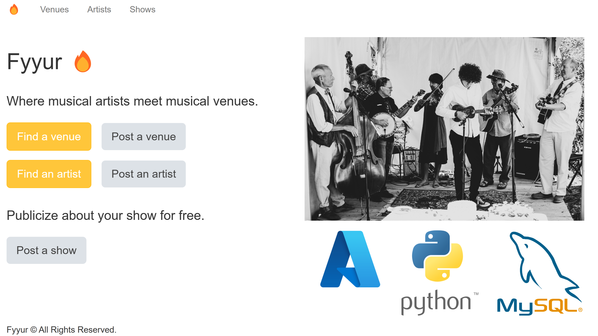

# Python (Flask) Web App with MySQL and Key Vault

Artists Booking Venues powered by Python (Flask) and MySQL Database.
There is no user authentication or per-user data stored.



The project is designed for deployment on Azure App Service with a MySQL flexible server. See deployment instructions below.

[](https://codespaces.new/john0isaac/flask-webapp-mysql-db?devcontainer_path=.devcontainer/devcontainer.json)


## Local Development

1. **Download the project starter code locally**

    ```bash
    git clone https://github.com/john0isaac/flask-webapp-mysql-db.git
    cd flask-webapp-mysql-db
    ```

2. **Install, initialize and activate a virtualenv using:**

    ```bash
    pip install virtualenv
    python -m virtualenv venv
    source venv/bin/activate
    ```

    >**Note** - In Windows, the `venv` does not have a `bin` directory. Therefore, you'd use the analogous command shown below:

    ```bash
    source venv\Scripts\activate
    ```

3. **Install the dependencies:**

    ```bash
    pip install -r requirements.txt
    ```

4. **Run the development server:**

    ```bash
    export FLASK_APP=app.py
    export FLASK_ENV=development
    export FLASK_DEBUG=true
    flask run --reload
    ```
    **For Windows, use [`setx`](https://learn.microsoft.com/windows-server/administration/windows-commands/setx) command shown below:**
   ```powershell
    setx FLASK_APP=app.py
    setx FLASK_ENV=development
    setx FLASK_DEBUG=true
    flask run --reload
    ```
   
6. **Verify on the Browser**

Navigate to project homepage [http://127.0.0.1:5000/](http://127.0.0.1:5000/) or [http://localhost:5000](http://localhost:5000)

## Deployment

This repository is set up for deployment on Azure App Service (w/MySQL flexible server) using the configuration files in the `infra` folder.

To deploy your own instance, follow these steps:

1. Sign up for a [free Azure account](https://azure.microsoft.com/free/)

2. Install the [Azure Dev CLI](https://learn.microsoft.com/azure/developer/azure-developer-cli/install-azd).

3. Initialize a new `azd` environment:

    ```shell
    azd init
    ```

    It will prompt you to provide a name (like "flask-app") that will later be used in the name of the deployed resources.

4. Provision and deploy all the resources:

    ```shell
    azd up
    ```

    It will prompt you to login, pick a subscription, and provide a location (like "eastus"). Then it will provision the resources in your account and deploy the latest code. If you get an error with deployment, changing the location (like to "centralus") can help, as there may be availability constraints for some of the resources.

5. When azd has finished deploying, you'll see an endpoint URI in the command output. Visit that URI to browse the app! 🎉

If you make any changes to the app code, you can just run this command to redeploy it:

```shell
azd deploy
```

## Security

It is important to secure the databases in web applications to prevent unwanted data access.
This infrastructure uses the following mechanisms to secure the MySQL database:

* Azure Firewall: The database is accessible only from other Azure IPs, not from public IPs. (Note that includes other customers using Azure).
* Admin Username: Randomly generated and stored in Key Vault.
* Admin Password: Randomly generated and stored in Key Vault.
* MySQL Version: Latest available on Azure, version 8.0, which includes security improvements.

⚠️ For even more security, consider using an Azure Virtual Network to connect the Web App to the Database.

## Costs

Pricing varies per region and usage, so it isn't possible to predict exact costs for your usage.

You can try the [Azure pricing calculator](https://azure.microsoft.com/pricing/calculator/) for the resources:

* Azure App Service: Free Tier with shared CPU cores, 1 GB RAM. [Pricing](https://azure.microsoft.com/pricing/details/app-service/linux/)
* MySQL Flexible Server: Burstable Tier with 1 CPU core, 20GB storage. Pricing is hourly. [Pricing](https://azure.microsoft.com/pricing/details/mysql/)
* Key Vault: Standard tier with 2 secrets. Vaults are offered in two service tiers—standard and premium. [Pricing](https://azure.microsoft.com/pricing/details/key-vault/)

⚠️ To avoid unnecessary costs, remember to take down your app if it's no longer in use,
either by deleting the resource group in the Portal or running `azd down`.
